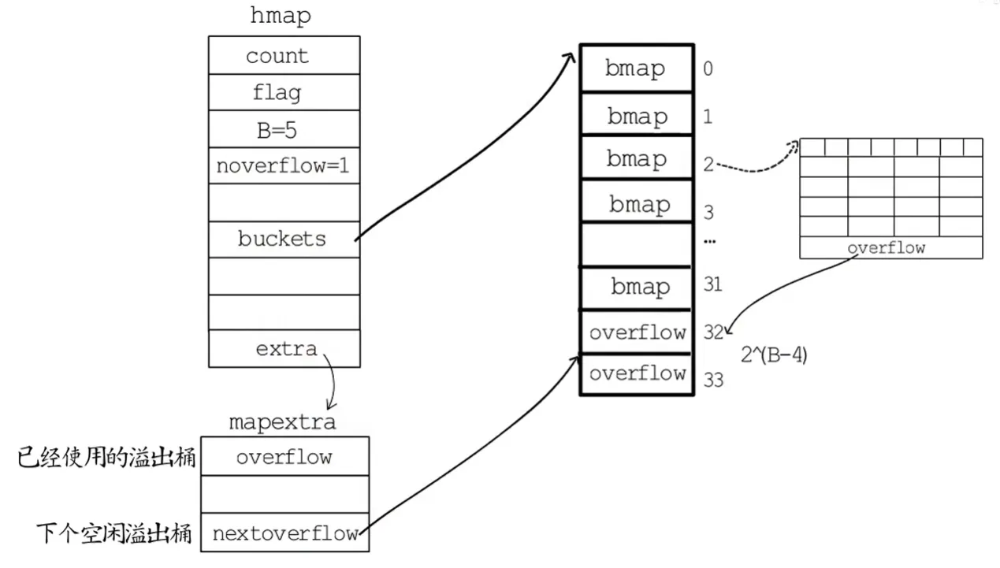

#### 1.数组和切片有什么异同

切片是对数组的封装，两者都可以通过下标访问元素。

数组是定长的，定义后不能再更改，在Go语言中使用较少，不同长度的数组表示不同的类型。

切片可以动态扩容，类型和长度无关，它的数据结构包括三个部分：1.指向底层数组的指针`array` 2.长度`len` 3.容量`cap` ，共3*8=24字节，初始化时使用`make`创建，而数组只能使用`new`创建。

#### 2.切片的结构和扩容规则，操作后底层数组的变化

向切片中添加元素时，如果长度没有超过容量，则底层数组不会改变只是长度增加；如果超过容量发生扩容，会重新分配一块内存，然后把原数组的内容复制过来，再将新的元素添加。

扩容机制在1.18版本以前的规则是：切片长度小于1024时进行双倍扩容，大于1024时渐进式扩容，每次扩容当前容量的1/4。

1.18版本后为了让切片扩容更加平滑，优化了扩容规则 1.双倍扩容：切片当前容量小于256时，容量直接翻倍 2.渐进式扩容：切片当前长度大于256时，新容量公式为`newcap += (newcap + 3*threshold) /4`，等价于扩容`1/4+192`。

#### 3.map的结构和扩容原理

```Go
type hmap struct {
    count     int  //元素的个数
    flags     uint8  //状态标志
    B         uint8  // 可以最多容纳 6.5 * 2^B 个元素(kv选择buckets时用的是与运算的方法)，6.5为装载因子
    noverflow uint16 // 使用的溢出桶的数量
    hash0     uint32 // 随机的hash种子，每个map不一样，减少哈希碰撞的几率

    buckets    unsafe.Pointer // 指向一个bmap数组
    oldbuckets unsafe.Pointer // 如果存在扩容会有扩容前的buckets
    nevacuate  uintptr        // 迁移进度，小于nevacuate的buckets已迁移完毕

    extra *mapextra // 记录溢出桶相关信息
}
```

```Go
type mapextra struct {
   overflow    *[]*bmap  // 当前使用的溢出桶
   oldoverflow *[]*bmap  // 扩容阶段存储旧桶的溢出桶

   // nextOverflow holds a pointer to a free overflow bucket.
   nextOverflow *bmap  // 下一个空闲溢出桶
}
```

```Go
type bmap struct {
    tophash [bucketCnt]uint8
}
```

map的本质是哈希表，底层为一个`hmap`结构体，hmap中使用桶`bmap`(buckets)来承接数据，每个桶能存8组k/v。当有数据读写时，会用`key`的hash值找到对应的桶。为加速hash来定位桶，`bmap`里记录了`tophash`(hash的高8位)，`bmap`中为了数据排列更加紧凑，把8个`key`放在一起，8个`value`放在一起，`key`的前面是8个`tophash`，最下面是一个溢出桶的指针。

当一个key经过hash指向的桶已经存满了，就会在该`bmap`的后面链一个溢出桶(overflow)来解决此问题。



扩容方式

map的扩容方式为`渐进式扩容`，为了避免一次性扩容后带来的瞬时性能抖动，map扩容时会先分配足够多的新桶，用一个字段来记录要迁移的旧桶的位置，再用一个字段记录旧桶迁移进度，每次读写操作时检查是否存在未迁移的旧桶，若存在，则从旧桶中选取一部分数据迁移到新桶，同时更新迁移进度，直到所有数据迁移完毕。

扩容规则

存储键值对的数量 `count`

桶数量 `m = 2^B`

负载因子 `loadFactor = count/m `

翻倍扩容

负载因子的值超过6.5就会触发翻倍扩容，分配新桶的数目是旧桶的两倍

等量扩容

创建和旧桶数量一样多的新桶

loadFactor没超过6.5，但溢出桶数量过多时会触发等量扩容

- B不大于15时，溢出桶数量大于常规桶等量扩容
- B大于15时，溢出桶数量大于2^15等量扩容

等量扩容的触发原因是很多溢出桶中的键值对被删除，经过重新排列后内存更加紧凑

#### 4.map是并发安全的吗

Go中的map不是并发安全的，如果同时对map进行一边遍历一遍删除的操作可能会引发`panic`，如果要保证线程安全，可以使用读写锁或者安全的`sync.Map`

#### 5.make和new的区别

在 Go 语言中，`make` 和 `new` 都是用于内存分配的关键字，但它们有着显著区别：

1. 适用类型

   `new`：仅用于分配内存，适用于`值类型`，`指针类型`和`接口类型`等，返回指向零值的指针

   `make`：专门用于创建并初始化`slice`、`map`和`channel`这三种引用类型。

2. 返回值

   `new`：返回指向已分配内存的指针

   `make`：直接返回初始化后的引用类型本身而非指针

3. 内存初始化

   `new`：分配的内存初始化为类型零值，不做额外初始化

   `make`：对切片初始化并按指定长度填充零值

#### 6.channel的结构和特性 

channel是Go语言中的一种核心数据结构，主要用于Goroutine间的通信和同步。channel分为有缓冲和无缓冲两种，有缓冲channel在缓冲区非空时可以异步操作，无缓冲channel的操作会同步或阻塞，使用`make`关键字来创建。

底层数据结构是`hchan`，主要包括`buf`、`sendq`、`recvq`、`sendx`、`recvx`等主要字段标识环形缓冲区。

```Go
type hchan struct {
	// chan 里元素数量
	qcount   uint
	// chan 底层循环数组的长度
	dataqsiz uint
	// 指向底层环形缓冲区的指针 只针对有缓冲的 channel
	buf      unsafe.Pointer
	// chan 中元素大小
	elemsize uint16
	// chan 是否被关闭的标志
	closed   uint32
	// chan 中元素类型
	elemtype *_type // element type
	// 已发送元素在循环数组中的索引
	sendx    uint   // send index
	// 已接收元素在循环数组中的索引
	recvx    uint   // receive index
	// 等待接收的 goroutine 队列
	recvq    waitq  // list of recv waiters
	// 等待发送的 goroutine 队列
	sendq    waitq  // list of send waiters
	// 保护 hchan 中所有字段
	lock mutex
}
```

其中`waitq`是一个双向链表，`lock`用来保证每个操作都是原子的

channel的常见用法包括Goroutine的数据传递、阻塞协程、结合select实现多路复用

#### 7.各种情况下对channel进行读写会有什么结果

对各种情况下的channel操作的结果如下

| 操作 | nil的channel | 已关闭的channel | 正常的channel |
| ---- | ------------ | --------------- | ------------- |
| 读取 | 阻塞         | 读到零值        | 成功或阻塞    |
| 写入 | 阻塞         | panic           | 成功或阻塞    |
| 关闭 | panic        | panic           | 成功          |

#### 8.值传递和引用传递的区别

Go语言中只有值传递，但通过指针、切片、映射、通道等类型可实现类似引用传递的效果。

值传递时，函数接收的是实参值的副本，对副本的修改不会影响原变量。

引用传递时对变量的修改会影响底层数据，因为它们虽然在函数间传递的是变量副本，但指针都指向同一块数据区域。

#### 9.怎么实现一个任务只被执行一次

1.使用`sync.Once`类型，它可以保证无论被调用多少次，`Once.Do`中的函数只会被执行一次

2.使用`init`函数，包首次被加载时，包内的`init`会被自动执行，且仅会执行一次

3.可以使用一个全局的布尔标识位，函数执行后置为`true`，并在函数开始执行时判断如果是`true`就跳过

#### 10.进程/线程/协程（Goroutine）的区别

进程是操作系统进行资源分配的基本单位，拥有独立的地址空间、内存、文件描述符等资源。不同进程间资源相互隔离，一个进程崩溃通常不会影响其他进程。但是上下文切换开销大，涉及内存映射、寄存器等资源的保存与恢复。

线程是进程内的执行单元，共享所属进程的资源，但拥有独立的栈空间和寄存器。线程上下文切换开销小于进程，主要涉及寄存器和栈的切换。

协程是一种轻量级的线程，也叫用户态线程，通常由编程语言或框架管理。多个协程可共享同一线程的资源，创建和销毁开销极小。切换由程序自身控制，不涉及系统调用，开销比线程更小。

#### 11.什么是Goroutine

`Goroutine`是Go语言中实现并发的关键，它是一种轻量级线程，使用`go`关键字启动一个`Goroutine`，各个`Goroutine`间通过`channel`实现通信，由Go语言的调度器通过`GMP`模型进行调度。

`Goroutine`的优势有三大方面 

1.内存占用小：一个`Goroutine`的初始栈大小为`2kb`，而`线程`则需要`2MB`或更大内存，并且可以在运行过程中实现自动扩容，支撑了Go程序可以创建成千上万的`Goroutine`。

2.传统线程创建和销毁是内核级的涉及到系统调用开销大；而`Goroutine`由Go运行时负责管理是用户级的，创建和销毁开销很小。

3.传统线程的切换涉及到操作系统的上下文切换，需要保存和恢复大量的寄存器状态、内存映射等信息，开销较大；`Goroutine`的切换由Go运行时的调度器负责，可以在用户态完成切换，成本远低于线程。


#### 12.CSP模型和常用并发机制

Go语言中强调要通过通信来共享内存而不是通过共享内存来通信，`Gorotinue`是并发通信的实体`channel`是Go中并发通信的媒介，使用`channel`通信可以避免共享内存带来的竞态和死锁问题，通过这种优雅实现使代码更加可读和易于维护。

Go中的并发控制一般有三种模型 1.基于`channel`的并发控制 2.基于`WaitGroup`的并发控制 3.基于`Context`的并发控制

#### 13.GMP模型 work stealing/hand off


#### 14.Go语言在云原生领域的优点

交叉编译 二进制体积小 社区强大

#### 15.Goroutine的生命周期控制


#### 15.Context的用法和理解


#### 16.GC机制


#### 17.两个Goroutine交替打印

1个channel，两个goroutine创建后，向channel中写入数据，期望先打印的goroutine启动后读数据，后打印的启动后写数据，就实现了交替打印

2个channel，两个goroutine创建后，分别从自己对应的channel中读数据，并在结束时向对方的goroutine中写数据

#### 18.select机制


#### 19.内存逃逸分析


#### 20.接口耗时长如何排查


#### 19.Cond和Broadcas/Signal


#### 20.微服务架构的特点和优势


#### 21.防止Goroutine超时怎么处理


